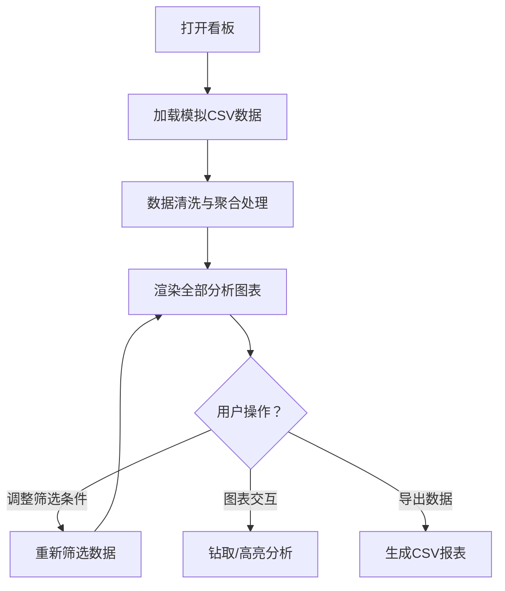

## 1. 产品概述

酒吧经营分析看板是一套专为酒吧运营管理者设计的数据可视化决策支持系统，通过整合时段、销售、翻台、客户、员工等多维度经营数据，为酒吧提供直观、全面的经营状况分析。

- 主要目的：帮助酒吧管理者清晰洞察经营数据，优化运营策略，提升营收效率和客户体验
- 目标用户：酒吧老板、运营经理、店长等经营决策者
- 市场价值：数据驱动的精细化运营已成为现代酒吧提升竞争力的核心手段，本看板填补了酒吧行业专业数据分析工具的空白

## 2. 核心功能

### 2.1 用户角色
| 角色 | 注册方式 | 核心权限 |
|------|----------|----------|
| 酒吧管理者 | 系统内置账号 | 查看全部经营数据、筛选分析维度、导出报表 |

### 2.2 功能模块
1. **时段分析模块**：营收占比曲线、开台率趋势、客单价变化分析
2. **酒水销售分析模块**：单品销量排行、毛利贡献榜、鸡尾酒受欢迎度
3. **翻台率分析模块**：桌台周转统计、桌型分类对比、效率营收关联
4. **客户结构分析模块**：新老客户占比、回头客消费频次分布
5. **客群画像模块**：会员年龄性别分布、各年龄段酒水品类偏好
6. **员工绩效模块**：调酒师出品效率、服务员销售业绩、小费收入排行

### 2.3 页面详情
| 页面名称 | 模块名称 | 功能描述 |
|----------|----------|----------|
| 数据看板首页 | 时段分析 | 展示21:00-02:00各小时段营收占比曲线、开台率趋势、客单价变化 |
| 数据看板首页 | 酒水销售分析 | 单品销量TOP20排行（区分杯售/瓶售）、毛利贡献TOP10、鸡尾酒TOP10 |
| 数据看板首页 | 翻台率分析 | 每张台周转次数、吧台/卡座/包间分类对比、翻台效率与营收关联散点图 |
| 数据看板首页 | 客户结构分析 | 新老客户占比饼图、回头客消费频次分布柱状图 |
| 数据看板首页 | 客群画像 | 会员年龄性别分布、18-34岁与35岁+客群酒水偏好对比 |
| 数据看板首页 | 员工绩效 | 调酒师出品效率排行、服务员销售业绩排行、小费收入排行 |
| 数据看板首页 | 全局筛选 | 日期范围选择、数据刷新、导出功能 |

## 3. 核心流程

用户打开看板后，系统自动加载模拟数据并渲染全部分析模块。用户可通过顶部筛选器选择日期范围，筛选后所有图表联动更新。支持点击图表元素进行钻取分析，支持导出关键数据报表。

## 4. 用户界面设计

### 4.1 设计风格
- **主色调**：深邃酒红色 `#722F37` 搭配暗金色 `#C9A962`，营造高端酒吧奢华氛围
- **辅助色**：炭黑色 `#1A1A1A` 背景、象牙白 `#F5F1E8` 文字
- **视觉风格**：暗色奢华主题，配合柔和光晕和微妙噪点纹理，呈现精致高端质感
- **按钮风格**：微圆角矩形按钮，暗金色描边，悬停时有柔和光晕动效
- **字体选择**：标题使用 Playfair Display（优雅衬线体），正文使用 Inter（现代无衬线体）
- **布局风格**：卡片式模块化布局，各分析模块独立成卡，支持响应式网格排列
- **图标风格**：线性极简图标，暗金色描边

### 4.2 页面设计概览
| 页面名称 | 模块名称 | UI元素 |
|----------|----------|--------|
| 数据看板首页 | 顶部导航栏 | 品牌Logo、日期筛选器、全局搜索、刷新按钮、导出按钮 |
| 数据看板首页 | KPI概览区 | 今日营收、总开台数、平均客单价、翻台率、会员到店率等核心指标卡片 |
| 数据看板首页 | 时段分析卡片 | 多折线组合图（营收占比/开台率/客单价三指标叠加），带图例切换 |
| 数据看板首页 | 酒水销售分析卡片组 | 三张横向排列的排行榜卡片，支持Tab切换视图 |
| 数据看板首页 | 翻台率分析卡片 | 左侧分类柱状图，右侧散点关联图，底部桌台明细表 |
| 数据看板首页 | 客户结构与画像卡片组 | 左右分栏布局，左侧客户结构饼图+柱状图，右侧画像分析图表 |
| 数据看板首页 | 员工绩效卡片 | 三列排行榜（调酒师/服务员/小费），带头像、姓名、数值、进度条 |

### 4.3 响应式
- **桌面优先设计**：针对 1920×1080 及以上分辨率优化，采用6列网格系统
- **平板适配（768px-1024px）**：模块自动换行，从三列变为两列布局
- **手机适配（<768px）**：单列纵向滚动布局，图表简化展示，筛选器折叠为抽屉
- **触摸优化**：移动端图表支持手势缩放，按钮最小触控区域 44×44px

### 4.4 数据可视化设计
- **图表库**：采用 ECharts 实现丰富的数据可视化效果
- **配色方案**：每个分析模块使用差异化的图表配色，整体保持暗金色调统一
- **动效设计**：图表加载时带渐入动画，数据更新时平滑过渡，鼠标悬停显示详细数据提示
