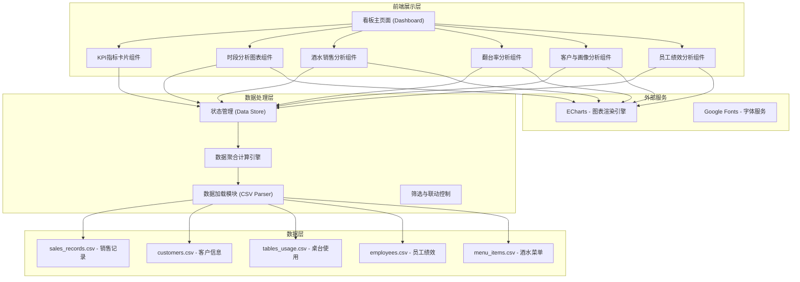
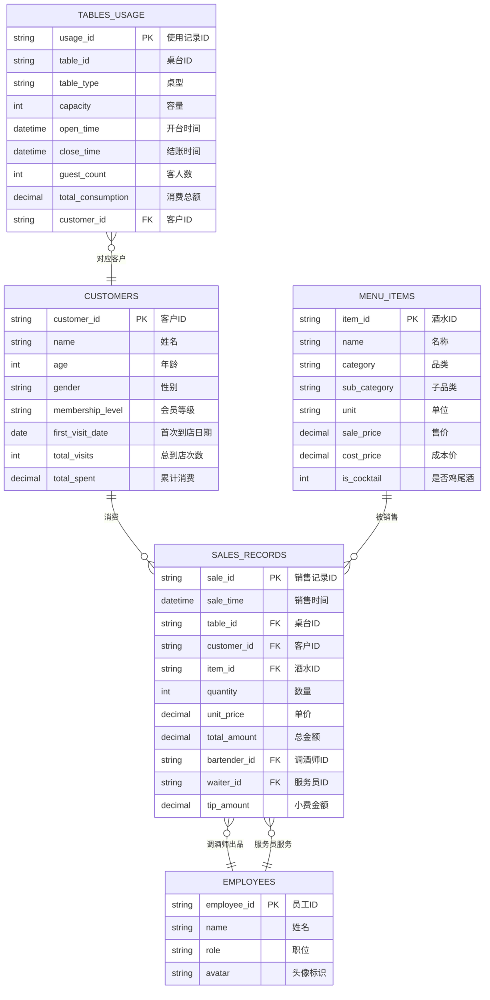

## 1. 架构设计



## 2. 技术说明

- **前端框架**：纯原生 HTML5 + CSS3 + JavaScript (ES6+)，无需构建工具，直接运行
- **图表库**：ECharts 5.x（通过 CDN 引入，提供丰富的图表类型和交互能力）
- **CSS 方案**：原生 CSS 变量 + Flex/Grid 布局，自定义暗色奢华主题
- **数据处理**：原生 JavaScript CSV 解析 + 函数式数据聚合
- **字体**：Google Fonts（Playfair Display + Inter）
- **数据存储**：CSV 文件模拟数据库，fetch API 异步加载

## 3. 路由定义

| 路由 | 用途 |
|------|------|
| /index.html | 数据看板主页面，包含全部分析模块 |

## 4. 数据模型

### 4.1 数据模型定义



### 4.2 CSV 数据文件结构

**sales_records.csv（销售记录，约2000条）**
| 字段 | 类型 | 说明 |
|------|------|------|
| sale_id | string | 销售记录唯一标识 |
| sale_time | datetime | 销售时间（21:00-02:00） |
| table_id | string | 桌台编号 |
| customer_id | string | 客户编号 |
| item_id | string | 酒水编号 |
| quantity | int | 销售数量 |
| unit_price | decimal | 成交单价 |
| total_amount | decimal | 总金额 |
| bartender_id | string | 调酒师编号 |
| waiter_id | string | 服务员编号 |
| tip_amount | decimal | 小费金额 |

**customers.csv（客户信息，约500条）**
| 字段 | 类型 | 说明 |
|------|------|------|
| customer_id | string | 客户唯一标识 |
| name | string | 姓名 |
| age | int | 年龄（18-65） |
| gender | string | 性别（男/女） |
| membership_level | string | 会员等级（普通/银卡/金卡/钻石） |
| first_visit_date | date | 首次到店日期 |
| total_visits | int | 累计到店次数 |
| total_spent | decimal | 累计消费金额 |

**tables_usage.csv（桌台使用，约300条/晚）**
| 字段 | 类型 | 说明 |
|------|------|------|
| usage_id | string | 使用记录ID |
| table_id | string | 桌台编号 |
| table_type | string | 桌型（吧台/卡座/包间） |
| capacity | int | 容量 |
| open_time | datetime | 开台时间 |
| close_time | datetime | 结账时间 |
| guest_count | int | 客人数 |
| total_consumption | decimal | 消费总额 |
| customer_id | string | 关联客户ID |

**employees.csv（员工信息，约20人）**
| 字段 | 类型 | 说明 |
|------|------|------|
| employee_id | string | 员工唯一标识 |
| name | string | 姓名 |
| role | string | 职位（调酒师/服务员） |
| avatar | string | 头像图标标识 |

**menu_items.csv（酒水菜单，约60款）**
| 字段 | 类型 | 说明 |
|------|------|------|
| item_id | string | 酒水唯一标识 |
| name | string | 酒水名称 |
| category | string | 大类（鸡尾酒/威士忌/精酿啤酒/红酒/其他） |
| sub_category | string | 子类 |
| unit | string | 销售单位（杯/瓶） |
| sale_price | decimal | 售价 |
| cost_price | decimal | 成本价 |
| is_cocktail | int | 是否鸡尾酒（1/0） |

## 5. 项目目录结构

```
d:\proje\label-109\
├── index.html                    # 主页面入口
├── css\
│   └── style.css                 # 主样式文件
├── js\
│   ├── data\
│   │   ├── sales_records.csv     # 销售记录数据
│   │   ├── customers.csv         # 客户信息数据
│   │   ├── tables_usage.csv      # 桌台使用数据
│   │   ├── employees.csv         # 员工信息数据
│   │   └── menu_items.csv        # 酒水菜单数据
│   ├── config.js                 # 全局配置（颜色、常量等）
│   ├── dataLoader.js             # CSV数据加载与解析模块
│   ├── dataProcessor.js          # 数据聚合计算模块
│   ├── charts\
│   │   ├── timeAnalysis.js       # 时段分析图表
│   │   ├── salesAnalysis.js      # 酒水销售分析图表
│   │   ├── turnoverAnalysis.js   # 翻台率分析图表
│   │   ├── customerAnalysis.js   # 客户与画像分析图表
│   │   └── employeeAnalysis.js   # 员工绩效分析图表
│   ├── components\
│   │   ├── kpiCards.js           # KPI指标卡片组件
│   │   ├── filters.js            # 筛选器组件
│   │   └── rankings.js           # 排行榜组件
│   └── main.js                   # 主入口文件，初始化所有模块
└── .trae\documents\
    ├── prd.md                    # 产品需求文档
    └── tech_architecture.md      # 技术架构文档
```
